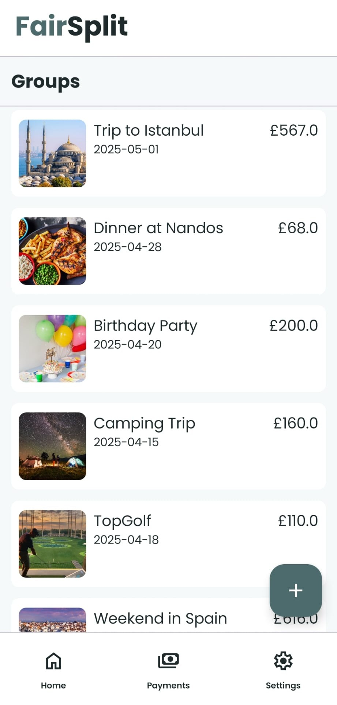
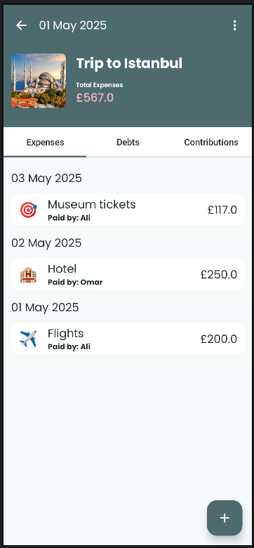
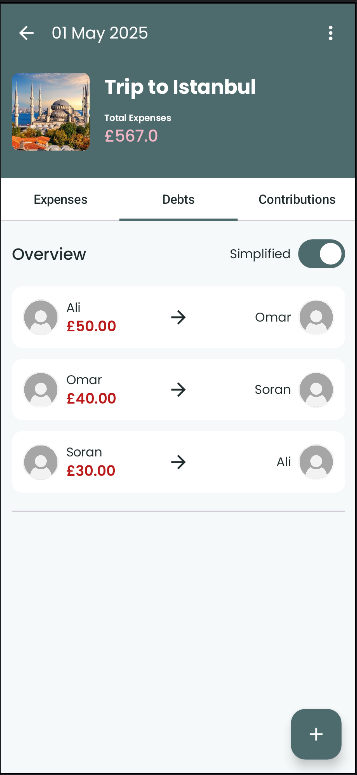

# splitin

splitin is a simple and intuitive **bill splitting app** built for Android using **Kotlin**, **Jetpack Compose**, and **Firebase**. The app allows users to track shared expenses, simplify debts, and manage contributions within groups.

---

## Features

- **Create and manage groups**  
- **Add expenses** with description, amount, category, and split among group members  
- **View simplified debts** and detailed owed breakdown  
- **Sign up / Log in** with email or Google (Firebase Auth)  
- **Modern, responsive UI** built with Jetpack Compose and Material3  
- Preview-friendly components for faster UI development  

---

## Tech Stack

- **Language:** Kotlin  
- **Architecture:** MVVM (Model-View-ViewModel)  
- **UI:** Jetpack Compose + Material3  
- **Backend / Auth:** Firebase (Authentication, Firestore)  
- **Image Loading:** Coil  

---

## Screenshots

<!--   

   -->

